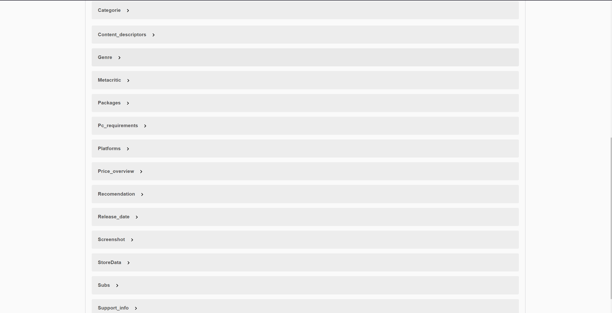

# DatuAtzipena1finala
  
<h2>Datuen Iturria</h2>

datuak kaggle web orritik atera ditut, Steam_Store_Data fitxategitik

Izatez, data set-a datubasean dagoena baino askoz handiagoa da, baina nabegadoreak kargatzen ez zuenez 500 erregistro ingurura murritzu dut, ala ere json biak daude errepositorio honetan, handia eta txikia

Datuak proiektuan erabili ahal izateko, lehenik datuak deskargatu nituen eta localhostean datu base bat sortu MongoDBCompass erabiliz, behin hau egin eta gero, datu base barruan kolekzio bat sortu nuen datuak gorde ahal izateko, arazo pare bat izan nituen joko bakoitzak Steam-eko id bat baizuen jadanik beraz id hori kendu behar izan dut eta gero kolekziora sartu.

<h2>Swagger</h2>

Honek dira API-an ditudan endpointak, hiru GET (bat denentzako,beste bat arrayekin eta azken bat objetuekin),DELETE bat,POST eta PUT bat

Bestalde, honek dira nire API-ak erabiltzen dituen klaseak, asko dira, mongok erregistroetako asko objetu moduan mapeatzen baititu,

Honek dira klaseak:
- Categorie
- Content_descriptors.java
- Genre
- Linux_requirements
- Mac_requirements
- Metacritic
- Packages
- Pc_requirements
- Platforms
- Price_overview
- Recomendation
- Release_date
- Screenshot
- StoreData(Nagusia, denak implementatzen dituena)
- Subs
- Support_info

<h2>Mongo Serbitzaria Datubasea eta kolekzioa</h2>

Nire kasuan nire mongo serbitzaria 27017 portuan dago, eta barruan Steam_Store_Data deituriko datu base bat du, eta izen berdineko kolekzio bat, 500 erregistro ingururekin errepositorian bi json fitxategi datuekin, Steam_Store_Data.json eta Steam_Store_Data.Steam_Store_Data.json, lehenengoa jokuen erregistro guztiak dituen eta aldatu gabe dagoen .JSON fitxategia da.

Bestalde bigarrena, 500 erregistro dituen eta egokituta dagoen JSON fitxategia da

<h2>Klase diagrama eta Martxan jartzea</h2>

Aplikazioa martxan jartzeko hurrengo pausuak jarraitu behar dira, Lehen aipatutako bigarren json fitxategia jaitsi, lokalean datu base bat sortu eta honen barruan kolekzio bat sortu, behin guzti hau egin eta gero jaitsitako fitxategitik datuak importatu kolekziora.

Jadanik kolekzioa sortuta eta datuak importatuta ditugunean, aplikazioa jaitsi eta application.properties fitxategira joan eta bertan zure serbitzariaren helbidea(ConnectionString-a) eta datubasea ezarri
